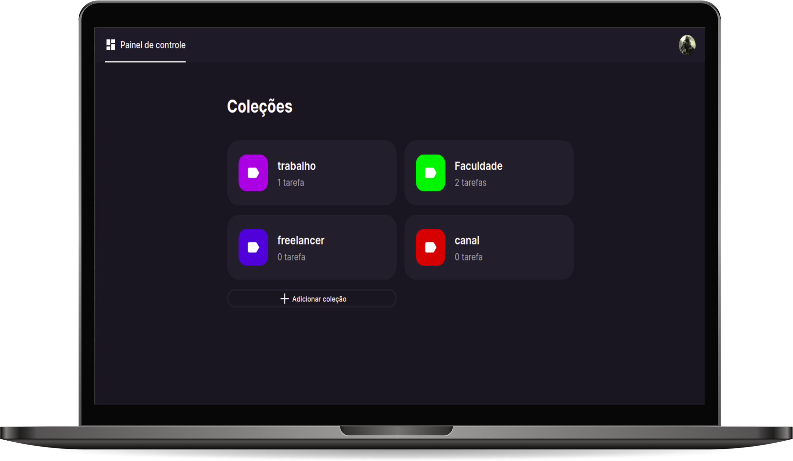

<p align="center">
  
<p/>

---

<p align="center">
     <a href="#-sobre">Sobre</a>&nbsp;&nbsp;&nbsp;|&nbsp;&nbsp;&nbsp;
    <a href="#-tecnologias">Tecnologias</a>&nbsp;&nbsp;&nbsp;|&nbsp;&nbsp;&nbsp;
    <a href="#-visualizar">Visualizar</a>&nbsp;&nbsp;&nbsp;|&nbsp;&nbsp;&nbsp;
    <a href="#-executar">Executar</a>&nbsp;&nbsp;&nbsp;
</p>

---



## ✨ Sobre
Task list é uma aplicação foi projetada para criar tarefas, dividindo-as em categorias, sendo possível marcá-las ou não como lidas.

## 🛠 Tecnologias
Esse projeto foi desenvolvido com as seguintes tecnologias:
- HTML
- CSS
- JavaScript
- Node js
- Express
- EJS
- SQlite
- JSONWebToken

## 🚀 Executar
Clone o projeto e acesse a pasta do mesmo.

```bash
git clone https://github.com/luccasscds/taskList.git
cd taskList
```

Para iniciá-lo, siga os passos abaixo:
```bash
#Instale o packajson
npm install

# Iniciar o projeto
npm run dev
```

O app estará disponível no seu browser pelo endereço http://localhost:3000.
